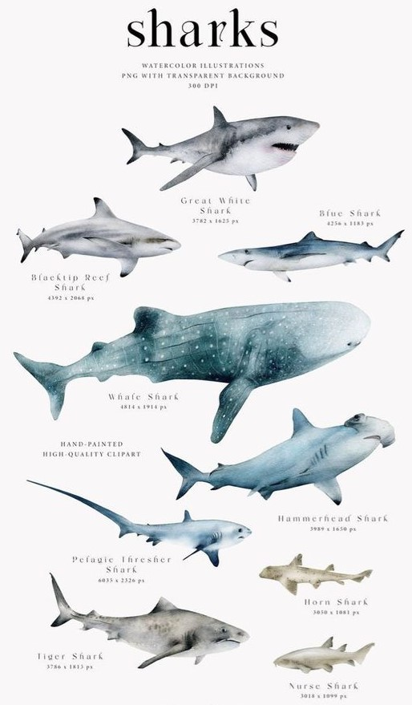

 <h3 align="center">Beyond the Bite: Exploring Shark Attacks and Reassessing the Human-Shark Relationship. Can we debunk their scary reputation?</h3>

    

<i>Let’s get to know sharks better! Remember! We as humans are not part of their diet .</i>

## Table of contents
- [Introduction](#introduction)
- [Data Cleaning and Preparation](#data-cleaning-and-preparation)
- [Exploratory Data Analysis](#exploratory-data-analysis)
- [Theory-Specific Analysis](#theory-specific-analysis)
  - [Hypothesis 1](#hypothesis-1-sharks-hate-surfers-especially-male-surfers)
  - [Hypothesis 2](#hypothesis-2-sharks-from-australia-are-les-aggressive-than-american-sharks)
  - [Hypothesis 3](#hypothesis-3-sharks-are-not-attacking-more-than-beforemaybe-we-are-the-problem)
- [Final thoughts](#final-thoughts)

## Introduction
**Are sharks truly dangerous predators? Do they actively hunt humans?** While sensationalist media  often portray sharks as relentless attackers, it's crucial to remember that humans are not their natural prey and that fatal encounters are relatively rare despite the extensive human presence in the ocean.

Obtaining data from the **GSAF (Global Shark Attack Dataset)**, up until 2018, reveals approximately 25000 recorded shark attacks. While this seems like a substantial amount of data, it's important to maintain perspective. Consider that **there's even a chance of death from a falling coconut** (you can verify this with a quick Google search!). Therefore, let's refrain from drawing conclusions prematurely.

Upon initial inspection, a significant portion of the dataset contains missing values. So, the first step is to clean up not only these missing values but also columns that may not be pertinent to my analysis.

 
 
      

 

## Data Cleaning and Preparation
Following the initial data retrieval, I began by removing columns that were not pertinent to my specific analysis, such as "Case Number," "Date," or "Investigator or source." However, these columns might be relevant for other types of analyses.

After that, I focused on addressing any inconsistencies or errors in the data, such as resolving discrepancies in activity descriptions. However, I refrained from further cleaning at this stage, opting instead to perform it separately for each subset corresponding to different hypotheses.
## Exploratory Data Analysis
Upon initial examination, I conducted descriptive statistics to understand the distribution of variables, including trends in fatal incidents over the years. This exploration will help me in the development of my hypothesis, specifically focusing on the **relationship between the variables "fatal" and "years.”**

    

    

Visualizing a **wordcloud** to get a first glimpse of the most common activities:

    

## Theory-Specific Analysis
### Hypothesis 1: Sharks hate surfers, especially male surfers.

    

Upon first exploratory analysis I observed that the majority of fatal shark attacks involved males, and also on another hand the most repeated activity during attacks was surfing. So I developed this hypothesis. 

So do sharks hate surfers? Do they confuse them with seals? Are they just jealous of the hability to surf the waves on top of their shiny surf tables? Let’s dig into it.

 

     

Digging more into fatalities:

    

**CONCLUSION:** These findings shift the perspective. While the majority of attacks occur during surfing, the highest fatality rate is associated with swimming activities, contradicting my initial hypothesis. It appears that while sharks may indeed target surfers, the gravest consequences are faced by swimmers.

### Hypothesis 2: Sharks from Australia are les aggressive than American sharks.

 
 
     

 

Given that the majority of recorded shark attacks occur in America, followed by Australia, one might question whether this indicates a correlation in their behavior. Alternatively, could it be that human activity is the primary driver of these shark attacks?

Remember that Provoked attacks occur when a human touches, hooks, nets, or otherwise aggravates the animal. Incidents that occur outside of a shark's natural habitat, such as aquariums and research holding-pens, are considered provoked, as are all incidents involving captured sharks. Sometimes humans inadvertently provoke an attack, such as when a surfer accidentally hits a shark with a surf board.

So let's see the the fatal incidents by country, Distribution per country and year and heatmap

    

    

    

In the first graph, we observe that the majority of attacks are reported from America. However, upon closer examination, Australia records the highest number of fatal attacks, despite a lower overall attack count.

Additionally, the distribution graph highlights an increase in documented attacks in recent years, with a significant portion of fatal incidents occurring in Africa.

The heat map further emphasizes these differences, with Australia topping the list for fatal attacks.

**CONCLUSION:** This evidence suggests that, regardless of species, sharks are more prone to causing fatal accidents in Australia, the USA, South Africa, and Papua New Guinea. Contrary to assumptions, they appear to be less "chill" or less likely to attack in these regions. Perhaps they don't appreciate the Aussie accent after all.

### Hypothesis 3: Sharks are not attacking more than before..maybe we are the problem?

 

      

So as there are provoked attacks there are also unprovoked, this may occur when the shark initiates contact with a live human in its natural habitat, without human provocation. Some categories are:

1. Hit-and-run attack: Typically non-fatal, the shark quickly bites and then departs. Often occurring in the surf zone or murky water, victims rarely see the shark. Mistaken identity is a common cause.
2. Sneak attack: Victims usually do not see the shark and may sustain multiple deep bites. This predatory attack is rare and intended for consumption.

So my hypothesis is that sharks are not attacking more than before in a unprovoked manner. There could be many reasons. Let’s see:

    

    

    

In the first graph, the majority of attacks appear to be unprovoked, whether fatal or not. This could be attributed to increased human presence and sea activities.

Analyzing the trend of shark attacks, we note a rise in incidents since 1990-2001. However, this observation must be approached cautiously, considering the potential influence of increased data availability post-2000. The violin graph highlights a peak in non-fatal attacks around the year 2000.

**CONCLUSION:** While these findings suggest trends, they're inconclusive due to data limitations (the shape of the distribution could came from a lack of data...) It's possible that historical data is scarce or that human activity in the water has surged in recent years. While shark behavior may remain consistent, our behavior in the water has likely evolved over time.

----
## Final thoughts
Why do sharks have a bad reputation? **These accidents are relatively rare, and while it's tempting to draw quick conclusions and hypotheses, further investigation reveals a more nuanced reality.**

The dataset aims to make data on shark attacks accessible to the public, shedding light on the true threat sharks pose to humans and how to avoid such encounters, not to cause fear.

We as humans may pose a significant threat to sharks (not the other way around) through activities such as overfishing, habitat destruction, pollution, and direct targeting for their fins and other body parts. These human-induced pressures have led to declines in shark populations worldwide and pose serious challenges to their survival. In contrast, while sharks are capable predators, their impact on human populations is minimal in comparison. Therefore, efforts to conserve sharks and protect marine ecosystems must address the various threats posed by human activities.
----
